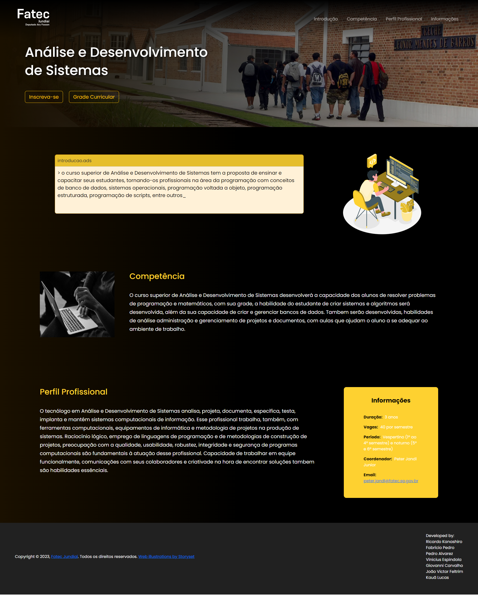
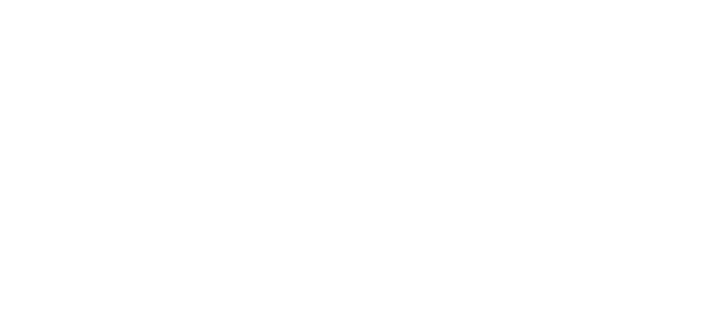

<h1 align="center">Curso Análise e Desenvolvimento de Sistemas - FATEC Ary Fossen - Site</h1>

    

    

Bem vindo ao nosso projeto! Esse projeto foi feito durante as aulas de Scripts da FATEC Ary Fossen de Jundiaí. O objetivo era criar uma página web, utilizando os conhecimentos e tecnologias, como: HTML, CSS, JavaScript, Bootstrap e JQuery, passados em aula sobre um dos cursos da nossa faculdade.

## Sobre o projeto:

Esse projeto é um site desenvolvido para o curso de Análise e Desenvolvimento de Sistemas da FATEC Ary Fossen, com o objetivo de guiar pessoas interessadas no curso, provendo informações sobre e links para inscrição e grade currícular.

## Tecnologias Utilizadas:

O projeto inteiro foi desenvolvido usando as seguintes tecnologias: 

    
    
    
    
    

